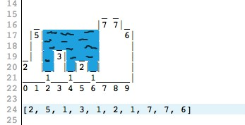
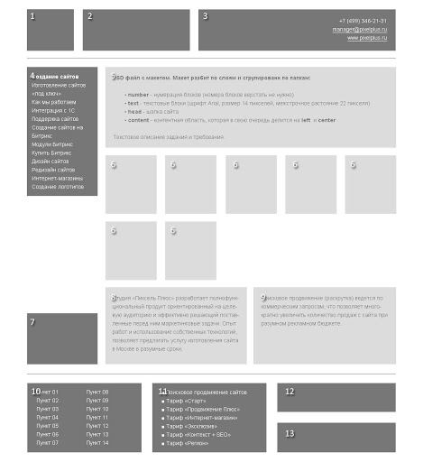

## 1) 
Дан масив чисел (положительных, отрицательных и в перемешку)
Найти max, min, sum
Залить на git решение
Нельзя использовать методы массива, а только циклы for, while*
Примеры массивов:
'''
[3,0,-5,1,44,-12,3,0,0,1,2,-3,-3,2,1,4,-2-3-1]
[-1,-8,-2]
[1,7,3]
[1,undefined,3,5,-3]
[1,NaN,3,5,-3]
'''
## 2) 
Дан масив чисел, которые представляют собой показатели высоты скал: [2, 5, 1, 2, 3, 4, 7, 7, 6]
(для примера дан этот масив, но может быть любой, Ваш алгоритм должен решать все случаи)
Посчитать количество воды (количество синих йчеек), набранной в ямы после дождя.
Нужно по возможности использовать методы массива, а не обычные цыклы.
Например, в даном примере правильный ответ: 17

Some cases:
'''
[2, 1, 5, 0, 3, 4, 7, 2, 3, 1, 0]; // 10
[2, 1, 5, 0, 3, 4, 7, 2, 3, 1, 0]; // 10
[7, 0, 1, 3, 4, 1, 2, 1] // 9
[2, 1, 5, 0, 3, 4, 7, 2, 3, 1, 0] // 10
[2, 2, 1, 2, 2, 3, 0, 1, 2] // 4
[2, 1, 5, 0, 3, 4, 7, 2, 3, 1, 8] // 24
[2, 2, 2, 2, 2] // 0
'''
## 3) 
Сверстать макет

